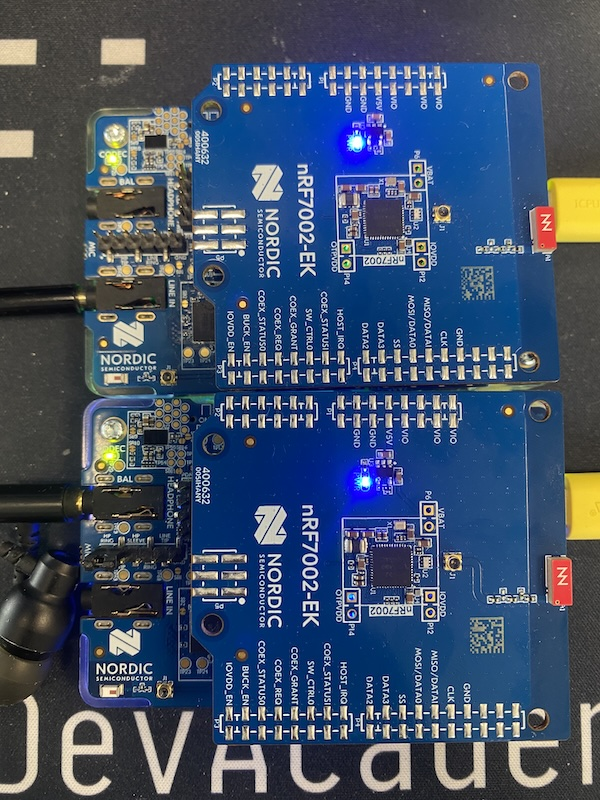
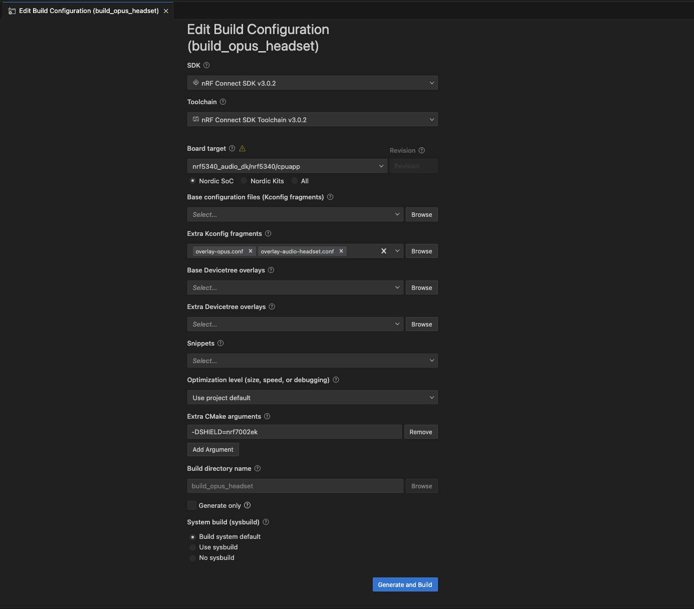
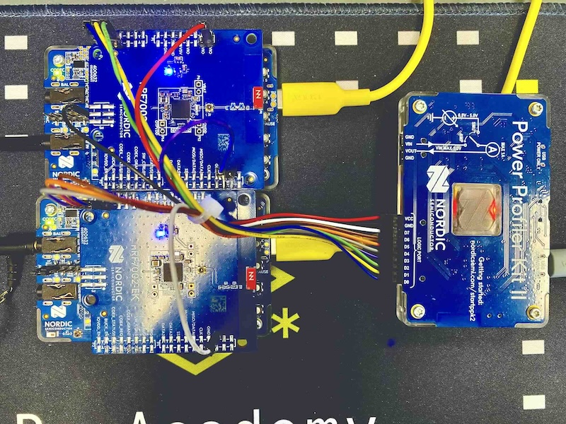
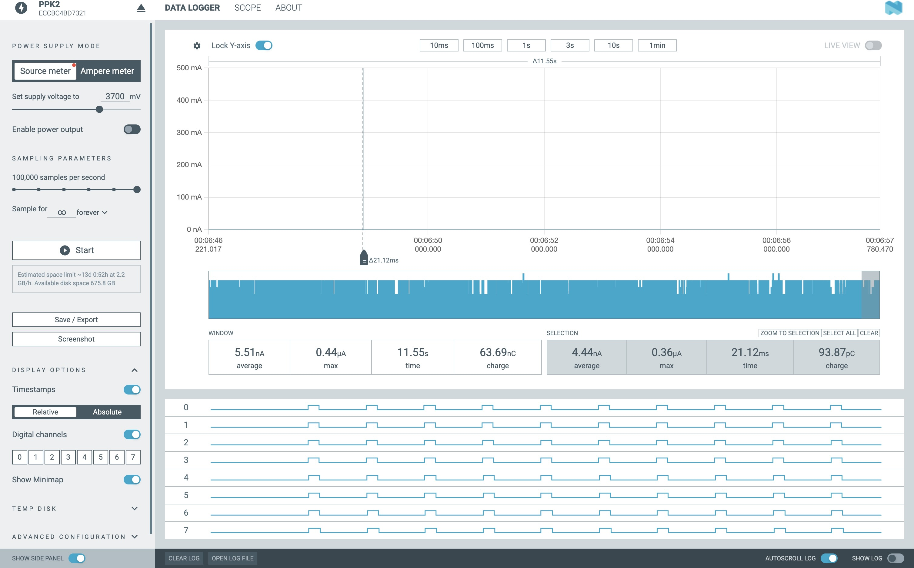

# Nordic Wi-Fi Opus Audio Demo

[](https://github.com/chshzh/nordic_wifi_opus_audio_demo/actions/workflows/build.yml)
[](LICENSE)
[](https://www.nordicsemi.com/Products/Development-software/nRF-Connect-SDK)


## 🔍 Overview

This project demonstrates how to use Wi-Fi with UDP sockets for real-time audio streaming. It is designed to showcase low-latency audio transfer, utilizing the nRF5340 Audio DK and nRF7002 EK platforms. This sample also integrates the Opus codec for efficient audio compression and decompression, offering flexibility for various network conditions.

## 🎯 Key Features

- **Real-time Audio Streaming**: Low-latency audio transfer over Wi-Fi networks
- **Opus Codec Integration**: Efficient audio compression with configurable bitrates (6kbps to 320kbps)
- **Low-Latency Transport**: Optimized UDP socket pipeline for audio streaming
- **Multiple Wi-Fi Modes**: Station mode with credential shell/static configuration and SoftAP mode for gateway-led pairing
- **Dual Device Setup**: Audio Gateway and Headset device roles
- **Battery Power Support**: Optional battery operation for headset device
- **mDNS Discovery**: Automatic device discovery within the same network (Need mDNS support in local network)

## 🔧 Hardware Requirements

### Essential Hardware
**HW:** 
- **nRF5340 Audio DK x 2** (Audio Gateway and Headset)
- **nRF7002EK x 2** (Plug in nRF5340 Audio DK as shield to support Wi-Fi)
- **USB C cable x 2**
- **Earphones/Headphones** with 3.5mm jack
- **Cable with Double 3.5mm jack Male Header(Optional)** 


### Optional Hardware Modifications for Wi-Fi Audio Headset Device
- **Enable Battery Power**: Connect nRF7002EK V5V pin to nRF5340 Audio DK TP30 testpoint.
- **Copy Audio Channel**: The device HW codec can only decode one channel from sound source, short nRF5340 Audio DK P14 pin1 and pin2 to output it on both headphone output channels.
- **Audio input through LINE IN** Get audio input through LINE IN. Need to add "overlay-gateway-linein.conf" when build audio gateway firmware.

The following picture shows a setup where the Audio Gateway (top) device uses LINE IN as the audio source.


### Software Requirements
**SW:** 
- **NCS v3.2.0** - Nordic Connect SDK
- **Opus v1.5.2** - Audio codec library

## 🚀 Quick Start Guide

### 1. Repository Setup

```bash
git clone https://github.com/chshzh/nordic_wifi_opus_audio_demo.git
cd nordic_wifi_opus_audio_demo/lib/opus
git submodule update --init
git checkout v1.5.2
```

### 2. Build and Flash Firmware

**Gateway Device:**
```bash
west build -p -b nrf5340_audio_dk/nrf5340/cpuapp -d build_opus_gateway -- -DSHIELD="nrf7002ek" -DEXTRA_CONF_FILE="overlay-opus.conf;overlay-audio-gateway.conf"
west flash --erase -d build_opus_gateway
```

**Gateway Device (SoftAP auto-pairing with LINE IN input):**
```bash
west build -p -b nrf5340_audio_dk/nrf5340/cpuapp -d build_opus_gateway_softap_linein -- -DSHIELD="nrf7002ek" -DEXTRA_CONF_FILE="overlay-opus.conf;overlay-audio-gateway.conf;overlay-gateway-softap.conf;overlay-gateway-linein.conf"
west flash --erase -d build_opus_gateway_softap_linein
```

**Headset Device:**
```bash
west build -p -b nrf5340_audio_dk/nrf5340/cpuapp -d build_opus_headset -- -DSHIELD="nrf7002ek" -DEXTRA_CONF_FILE="overlay-opus.conf;overlay-audio-headset.conf"
west flash --erase -d build_opus_headset
```

### 3. Connect and Configure Wi-Fi

Use the Wi-Fi credentials shell on the gateway device:
```
uart:~$ wifi cred add -s wifi_ssid -p wifi_password -k 1
uart:~$ wifi cred auto_connect
```

> **Tip:** When the gateway firmware includes `overlay-gateway-softap.conf`, it hosts the `GatewayAP` network and the headset auto-discovers the fixed target at `192.168.1.1`—no Wi-Fi shell configuration required.

### 4. Start Audio Streaming

1. Set audio gateway as output device on your PC
2. Connect headphones to the headset device
3. Press play/pause on headset device to start/stop streaming
4. Use VOL+/- buttons to adjust volume

### 5. SoftAP Direct Audio Link (Gateway ↔ Headset)

When you build the gateway with `overlay-gateway-softap.conf`, the two audio DKs can form a self-contained Wi-Fi link without an external router. The diagram below shows the wiring and roles:

```
[Wi-Fi Audio Gateway (nRF5340 + nRF7002)] <--Wi-Fi--> [Wi-Fi Audio Headset (nRF5340 + nRF7002)] ──USB-C── [5 V Power Bank]
        ▲                                              │
        │ USB-C Audio and Power                        │ 3.5 mm Audio Out
        │                                              ▼
      [Windows PC]                                   [Headphones]
```

Follow these steps for a quick standalone setup:

1. Connect the Wi-Fi Audio Gateway to a Windows PC with a USB-C cable; the board powers up and enumerates as a USB sound card.
2. Select the **nRF5340 Audio DK** as the audio output device on the PC and start playback.
3. Power the Wi-Fi Audio Headset from a 5 V USB supply (for example, a USB-C power bank).
4. Wait for the headset to auto-join the `GatewayAP` Wi-Fi network; a blinking blue LED indicates active streaming.
5. Plug your headphones into the headset’s 3.5 mm output. Use the play/pause button to toggle streaming as needed.

## ⚙️ Configuration Guide

### Opus Codec Configuration

Fine-tune audio quality and performance by adjusting Opus codec parameters:

| **Parameter**       | **Description**                                    | **Default Value**      | **Notes**                                                   |
|---------------------|----------------------------------------------------|-------------------------|------------------------------------------------------------|
| `Bitrate`           | Controls the quality and bandwidth usage.          | 320kbps       | Higher bitrate improves quality but increases CPU usage and frame encoding time.    |
| `Frame Size`        | Duration of each audio frame in milliseconds.      | 10ms                     | Smaller frames reduce latency but increase overhead.        |
| `Complexity`        | Encoding complexity level (0-10).                  | 0                        | Lower values reduce CPU usage; higher values improve quality. |
| `Application`       | Optimization mode (VoIP, Audio, or Automatic).     | `OPUS_APPLICATION_AUDIO` | Choose based on use case (e.g., VoIP for voice).            |
| `Packet Loss (%)`   | Expected network packet loss rate.                 | 15%                      | Enables PLC (Packet Loss Concealment) to improve stability. |
| `VBR`               | Variable Bitrate mode (enabled/disabled).          | Disabled                 | Dynamically adjusts bitrate for better network adaptation.  |

### Build Configuration Options

The sample supports multiple build configurations through overlay files:

- **`overlay-opus.conf`** - Enable Opus codec support, otherwise raw PCM data.
- **`overlay-audio-gateway.conf`** - Configure device as audio gateway
- **`overlay-audio-headset.conf`** - Configure device as audio headset
- **`overlay-gateway-softap.conf`** - Enable gateway SoftAP mode with static 192.168.1.1 service
- **`overlay-wifi-sta-static.conf`** - Use static Wi-Fi credentials
- **`overlay-gateway-linein.conf`** - Enable gateway device to use LINE IN as audio input instead of USB

## 📋 Building

Here are some building examples:

### WiFi Station Mode + WiFi CREDENTIALS SHELL (for SSID+Password Input) + UDP + Opus Audio
> ⚠️ Recommended, you can download the following three firmware from release page.

**Gateway USB Audio Source:**
```bash
west build -p -b nrf5340_audio_dk/nrf5340/cpuapp -d build_opus_gateway -- -DSHIELD="nrf7002ek" -DEXTRA_CONF_FILE="overlay-opus.conf;overlay-audio-gateway.conf"
west flash --erase -d build_opus_gateway
```

**Gateway SoftAP USB Audio Source (auto-connects headset, fixed 192.168.1.1):**
```bash
west build -p -b nrf5340_audio_dk/nrf5340/cpuapp -d build_opus_gateway_softap -- -DSHIELD="nrf7002ek" -DEXTRA_CONF_FILE="overlay-opus.conf;overlay-audio-gateway.conf;overlay-gateway-softap.conf"
west flash --erase -d build_opus_gateway_softap
```

**Gateway LINE IN Audio Source:**
```bash
west build -p -b nrf5340_audio_dk/nrf5340/cpuapp -d build_opus_gateway -- -DSHIELD="nrf7002ek" -DEXTRA_CONF_FILE="overlay-opus.conf;overlay-audio-gateway.conf;overlay-gateway-linein.conf"
west flash --erase -d build_opus_gateway
```

**Gateway SoftAP LINE IN Audio Source (auto-connects headset):**
```bash
west build -p -b nrf5340_audio_dk/nrf5340/cpuapp -d build_opus_gateway_softap_linein -- -DSHIELD="nrf7002ek" -DEXTRA_CONF_FILE="overlay-opus.conf;overlay-audio-gateway.conf;overlay-gateway-softap.conf;overlay-gateway-linein.conf"
west flash --erase -d build_opus_gateway_softap_linein
```

**Headset:**
```bash
west build -p -b nrf5340_audio_dk/nrf5340/cpuapp -d build_opus_headset -- -DSHIELD="nrf7002ek" -DEXTRA_CONF_FILE="overlay-opus.conf;overlay-audio-headset.conf"
west flash --erase -d build_opus_headset
```

### WiFi Station Mode + WiFi CREDENTIALS SHELL (for SSID+Password Input) + UDP + Raw PCM Audio

**Gateway:**
```bash
west build -p -b nrf5340_audio_dk/nrf5340/cpuapp -d build_gateway -- -DSHIELD="nrf7002ek" -DEXTRA_CONF_FILE="overlay-audio-gateway.conf"
west flash --erase -d build_gateway
```
**Headset:**
```bash
west build -p -b nrf5340_audio_dk/nrf5340/cpuapp -d build_headset -- -DSHIELD="nrf7002ek" -DEXTRA_CONF_FILE="overlay-audio-headset.conf"
west flash --erase -d build_headset
```

### 🔒 WiFi Station Mode + Static SSID & PASSWORD + UDP + Opus Audio

**Gateway:**
```bash
west build -p -b nrf5340_audio_dk/nrf5340/cpuapp -d build_static_gateway -- -DSHIELD="nrf7002ek" -DEXTRA_CONF_FILE="overlay-wifi-sta-static.conf;overlay-audio-gateway.conf"
west flash --erase -d build_static_gateway

west build -p -b nrf5340_audio_dk/nrf5340/cpuapp -d build_static_opus_gateway -- -DSHIELD="nrf7002ek" -DEXTRA_CONF_FILE="overlay-wifi-sta-static.conf;overlay-opus.conf;overlay-audio-gateway.conf"
west flash --erase -d build_static_opus_gateway
```

**Headset:**
```bash
west build -p -b nrf5340_audio_dk/nrf5340/cpuapp -d build_static_headset -- -DSHIELD="nrf7002ek" -DEXTRA_CONF_FILE="overlay-wifi-sta-static.conf;overlay-audio-headset.conf"
west flash --erase -d build_static_headset

west build -p -b nrf5340_audio_dk/nrf5340/cpuapp -d build_static_opus_headset -- -DSHIELD="nrf7002ek" -DEXTRA_CONF_FILE="overlay-wifi-sta-static.conf;overlay-audio-headset.conf;overlay-opus.conf"
west flash --erase -d build_static_opus_headset
```

### Building configuration example for nRF Connect SDK VS code extension



## 🎮 Operation Guide

### WiFi CREDENTIALS SHELL Example (Station Mode)

#### 1) Connect WiFi Gateway and Audio Devices with WiFi Router

```
uart:~$ wifi cred
wifi cred - Wi-Fi Credentials commands
Subcommands:
  add           : Add network to storage.
                  <-s --ssid "<SSID>">: SSID.
                  [-c --channel]: Channel that needs to be scanned for
                  connection. 0:any channel.
                  [-b, --band] 0: any band (2:2.4GHz, 5:5GHz, 6:6GHz]
                  [-p, --passphrase]: Passphrase (valid only for secure SSIDs)
                  [-k, --key-mgmt]: Key Management type (valid only for secure
                  SSIDs)
                  0:None, 1:WPA2-PSK, 2:WPA2-PSK-256, 3:SAE-HNP, 4:SAE-H2E,
                  5:SAE-AUTO, 6:WAPI, 7:EAP-TLS, 8:WEP, 9: WPA-PSK, 10:
                  WPA-Auto-Personal, 11: DPP
                  [-w, --ieee-80211w]: MFP (optional: needs security type to be
                  specified)
                  : 0:Disable, 1:Optional, 2:Required.
                  [-m, --bssid]: MAC address of the AP (BSSID).
                  [-t, --timeout]: Timeout for the connection attempt (in
                  seconds).
                  [-a, --identity]: Identity for enterprise mode.
                  [-K, --key-passwd]: Private key passwd for enterprise mode.
                  [-h, --help]: Print out the help for the connect command.

  auto_connect  : Connect to any stored network.
  delete        : Delete network from storage.
  list          : List stored networks.
  
uart:~$ wifi cred add -s wifi_ssid -p wifi_password -k 1
uart:~$ wifi cred auto_connect
```

The device will remember this set of credential and autoconnect to target router after reset.
Headset device will find Gateway device automatically through mDNS in the same network.

#### 2) Set Audio Gateway as Output on PC and Start Audio Streaming

After socket connection is established:
1. Make sure your host PC chooses **nRF5340 USB Audio (audio gateway)** as audio output device
2. Press **play/pause** on headset device to start/stop audio streaming
3. Use **VOL+/-** buttons to adjust volume

## 🚦 LED Status Indicators

The device provides multiple LED indicators for comprehensive visual feedback about device type, network status, and streaming activity:

### Device Type Indicators (APP RGB LED)

| **LED Color** | **Device Type** | **Description** |
|---------------|-----------------|-----------------|
| **🟢 Green** | Audio Gateway | Device configured as audio gateway |
| **🔵 Blue** | Headset Left Channel | Headset device configured for left audio channel |
| **🟣 Magenta** | Headset Right Channel | Headset device configured for right audio channel |

### Network Status Indicators (Network RGB LED)

| **LED Color** | **Network Status** | **Description** |
|---------------|-------------------|-----------------|
| **🔴 Red** | Network Disconnected | Wi-Fi connection lost or not established |
| **🟢 Green** | Network Connected | Wi-Fi connected and ready for streaming |

### Streaming Activity Indicators (Blue LED)

| **LED Behavior** | **Streaming Status** | **Description** |
|------------------|---------------------|-----------------|
| **🔵 Blinking Blue** | Audio Streaming | Audio is actively streaming between devices |
| **🔵 Solid Blue** | Audio Paused | Audio streaming is paused but ready to resume |
| **💡 Off** | Audio Stopped | No audio streaming activity |

## 📊 Latency Measurement System

This project includes a comprehensive GPIO-based latency measurement system for analyzing end-to-end audio processing latency. The system measures eight key timing points across the audio pipeline from capture to output.

### 🎯 Timing Point Overview

The latency measurement tracks 8 critical timing points across both gateway and headset devices:

| **Timing Point** | **Device** | **GPIO Pin** | **Description** |
|------------------|------------|--------------|-----------------|
| **T1** | Gateway | P0.26 | Audio input capture start |
| **T2** | Gateway | P0.25 | Audio encoding start |
| **T3** | Gateway | P0.07 | Audio encoding complete |
| **T4** | Gateway | P0.28 | Network transmission start |
| **T5** | Headset | P0.26 | Network reception complete |
| **T6** | Headset | P0.25 | Audio decoding start |
| **T7** | Headset | P0.07 | Audio decoding complete |
| **T8** | Headset | P0.28 | Audio output to I2S/DAC |

### ⚡ Key Latency Metrics

The system enables measurement of critical latency components:

- **Input Buffering**: T2 - T1 (Audio capture to encoding delay)
- **Encoding Latency**: T3 - T2 (Gateway audio processing)
- **Network Transmission**: T5 - T4 (WiFi transfer + network stack)
- **Decoding Latency**: T7 - T6 (Headset audio processing)
- **Output Buffering**: T8 - T7 (Decoding to audio output delay)
- **Total End-to-End**: T8 - T1 (Complete audio pipeline)

### 🔧 Hardware Setup for Measurement

#### Using PPK2 (Power Profiler Kit 2)

The recommended measurement setup uses Nordic's PPK2 for synchronized multi-channel logic analysis:




**PPK2 Connections:**
> Need some soldering work for the used GPIO pins.
- **D0 Channel**: Connect to Gateway P0.26 (T1 timing trigger)
- **D1 Channel**: Connect to Gateway P0.25 (T2 timing trigger)
- **D2 Channel**: Connect to Gateway P0.07 (T3 timing trigger)
- **D3 Channel**: Connect to Gateway P0.28 (T4 timing trigger)
- **D4 Channel**: Connect to Headset P0.26 (T5 timing trigger)
- **D5 Channel**: Connect to Headset P0.25 (T6 timing trigger)
- **D6 Channel**: Connect to Headset P0.07 (T7 timing trigger)
- **D7 Channel**: Connect to Headset P0.28 (T8 timing trigger)
- **GPIO VDD Reference**: Connect PPK2 VDD (logic reference) to the 3.3V supply rail of the nRF5340 Audio DK (for correct logic level detection)

**PPK2 Configuration:**
- **Sampling Rate**: 100kHz maximum (10μs resolution)
- **Digital Channels**: Enable D0-D7 monitoring
- **Trigger Setup**: Use rising edge as measurement trigger



**Data Export Process:**
1. Record test session using Power Profiler software
2. Select time window containing measurement data
3. Export to CSV format with "Timestamp" and "Digital logic pins (separate fields)" options

**Measurement Method:**
```
Input Buffering = Time(T2 Rising Edge) - Time(T1 Rising Edge)
Encoding Latency = Time(T3 Rising Edge) - Time(T2 Rising Edge)
Network Latency = Time(T5 Rising Edge) - Time(T4 Rising Edge)
Decoding Latency = Time(T7 Rising Edge) - Time(T6 Rising Edge)
Output Buffering = Time(T8 Rising Edge) - Time(T7 Rising Edge)
End-to-End Latency = Time(T8 Rising Edge) - Time(T1 Rising Edge)
```

### 🧪 Testing Procedures

#### Build and program Latency Measurement Firmware
```bash
# Gateway with latency measurement
west build -p -b nrf5340_audio_dk/nrf5340/cpuapp -d build_opus_gateway_latency -- -DSHIELD="nrf7002ek" -DEXTRA_CONF_FILE="overlay-opus.conf;overlay-audio-gateway.conf;overlay-latency-measure.conf"
west flash --erase -d build_opus_gateway_latency

# Headset with latency measurement
west build -p -b nrf5340_audio_dk/nrf5340/cpuapp -d build_opus_headset_latency -- -DSHIELD="nrf7002ek" -DEXTRA_CONF_FILE="overlay-opus.conf;overlay-audio-headset.conf;overlay-latency-measure.conf"
west flash --erase -d build_opus_headset_latency
```

#### Automated Testing with Built-in Frame Generator

For consistent and repeatable measurements, use the built-in latency test system:

1. **Connect Devices**: Ensure WiFi connection between gateway and headset
2. **Trigger Test**: Press BUTTON_PLAY_PAUSE on headset device
3. **Automated Sequence**: System generates configured test frames with timing
4. **Synchronized Timing**: All 8 timing points are triggered with each frame

**Built-in Test Features:**
- **Frame Count**: Configurable (default: 10 frames per test)
- **Interval**: Configurable (default: 1000ms between frames)
- **Content**: 1kHz test tone for consistent encoding load
- **Timing**: All T1-T8 points triggered in sequence
- **Hardware Independence**: No external audio source required


### 🔧 Configuration Options

The latency measurement system can be configured through Kconfig:

```kconfig
# Enable latency measurement system
CONFIG_LATENCY_MEASUREMENT=y

# Number of frames to send during automated test (default: 10)
CONFIG_LATENCY_MEASUREMENT_FRAME_COUNT=10

# Interval between frames in milliseconds (default: 1000)
CONFIG_LATENCY_MEASUREMENT_FRAME_INTERVAL=1000

# Pulse duration for GPIO signals (milliseconds, default: 100)
CONFIG_LATENCY_PULSE_DURATION_MS=100

# Debug output for timing events
CONFIG_LATENCY_MEASUREMENT_DEBUG=y
```

### 🛠️ Analysis Scripts

The project includes Python analysis tools for automated latency calculation from PPK2 recordings:

```bash
# Navigate to script directory
cd script/

# Basic analysis with auto-detection of timing points
python ppk_audio_latency_analysis.py -i audio_test.csv

# Save results to file with detailed breakdown
python ppk_audio_latency_analysis.py -i audio_test.csv -o results.md

# Custom analysis with specific parameters
python ppk_audio_latency_analysis.py -i audio_test.csv -m 100.0 --frames 10

# Verbose output with debug information
python ppk_audio_latency_analysis.py -i audio_test.csv --verbose
```

**Enhanced Script Features:**
- **8-Point Analysis**: Automatic detection of all T1-T8 timing points
- **Multi-Device Support**: Handles both gateway and headset timing events
- **Frame Synchronization**: Intelligent pairing of timing points across frames
- **Statistical Analysis**: Comprehensive latency breakdown with percentiles
- **Markdown Output**: Professional formatted tables for documentation
- **Error Handling**: Robust validation and filtering of invalid measurements
- **Progress Monitoring**: Real-time feedback during large file processing

**Expected CSV Format** (PPK2 export):
```csv
Timestamp(ms),D0,D1,D2,D3,D4,D5,D6,D7
0.000,0,0,0,0,0,0,0,0
0.010,0,0,0,0,0,0,0,0
0.020,1,0,0,0,0,0,0,0  ← D0 rising edge (Gateway T1)
0.025,1,1,0,0,0,0,0,0  ← D1 rising edge (Gateway T2)
0.030,1,1,1,0,0,0,0,0  ← D2 rising edge (Gateway T3)
0.035,1,1,1,1,0,0,0,0  ← D3 rising edge (Gateway T4)
0.045,1,1,1,1,1,0,0,0  ← D4 rising edge (Headset T5)
0.050,1,1,1,1,1,1,0,0  ← D5 rising edge (Headset T6)
0.055,1,1,1,1,1,1,1,0  ← D6 rising edge (Headset T7)
0.060,1,1,1,1,1,1,1,1  ← D7 rising edge (Headset T8)
```

**Automated Analysis Features:**
- **Intelligent Trigger Detection**: Automatically identifies timing patterns
- **Frame Reconstruction**: Assembles complete T1-T8 sequences
- **Latency Calculation**: Computes encoding, network, decoding, and total latencies
- **Quality Metrics**: Validates measurement consistency and flags anomalies

**Pin Safety:**
- All selected pins verified available and not conflicting with essential audio functions
- Pins maintain 3.3V logic levels compatible with standard measurement equipment
- 100ms pulse width provides reliable trigger detection while minimizing system impact
- LED functionality automatically disabled during latency measurement to prevent GPIO conflicts

### 📚 Implementation Details

**Code Integration Points:**
- **T1**: Audio source simulator in `audio_system_latency_meas_frame_generate()`
- **T2/T3**: Encoder thread in `audio_system.c` around `sw_codec_encode()`
- **T4**: Network transmission in `wifi_audio_rx.c` in `send_audio_frame()`
- **T5**: Network reception in `wifi_audio_rx.c` in `wifi_audio_rx_data_handler()`
- **T6/T7**: Decoder in `audio_datapath.c` around `sw_codec_decode()`
- **T8**: Audio output in `audio_datapath.c` in I2S callback

**Key Features:**
- **Conditional Compilation**: Only compiled when `CONFIG_LATENCY_MEASUREMENT=y`
- **LED Conflict Resolution**: LED functions disabled during measurement mode
- **Remote Triggering**: Headset BUTTON_PLAY_PAUSE triggers gateway test sequence
- **Hardware Independence**: Built-in audio source simulator eliminates need for external audio

### Wi-Fi Latency Results

> **⚠️ Test Environment Notice:**
> The following results were obtained in an office environment using a 5GHz Wi-Fi router channel. Actual latency and performance may vary depending on your specific testing environment, network conditions, and interference sources.


### Raw PCM Stereo Audio (48kHz sampling rate)
WIFI Audio Latency Table(Unit: ms)
| Frame | T2-T1 (Input Buffer) | T3-T2 (Encoding) | T5-T4 (Network) | T7-T6 (Decoding) | T8-T7 (Output Buffer) | T8-T1 (Total E2E) |
|---|---|---|---|---|---|---|
| 1 | 0.34 | 0.01 | 6.90 | 0.00 | 0.58 | 9.96 |
| 2 | 0.35 | 0.00 | 14.20 | 0.00 | 0.78 | 17.50 |
| 3 | 0.34 | 0.00 | 16.26 | 0.00 | 0.22 | 18.99 |
| 4 | 0.35 | 0.00 | 48.07 | 0.01 | 0.90 | 51.51 |
| 5 | 0.35 | 0.00 | 13.58 | 0.00 | 0.91 | 17.01 |
| 6 | 0.34 | 0.00 | 13.32 | 0.00 | 0.72 | 16.54 |
| 7 | 0.35 | 0.00 | 28.26 | 0.01 | 0.27 | 31.05 |
| 8 | 0.34 | 0.01 | 15.70 | 0.00 | 0.34 | 18.55 |
| 9 | 0.34 | 0.01 | 15.62 | 0.00 | 0.92 | 19.06 |
| 10 | 0.35 | 0.00 | 41.47 | 0.00 | 0.61 | 44.60 |
| **Max** | 0.35 | 0.01 | 48.07 | 0.01 | 0.92 | 51.51 |
| **Min** | 0.34 | 0.00 | 6.90 | 0.00 | 0.22 | 9.96 |
| **Average** | 0.35 | 0.00 | 21.34 | 0.00 | 0.62 | 24.48 |

### Opus 320kbps Stereo Audio
WIFI Audio Latency Table(Unit: ms)
| Frame | T2-T1 (Input Buffer) | T3-T2 (Encoding) | T5-T4 (Network) | T7-T6 (Decoding) | T8-T7 (Output Buffer) | T8-T1 (Total E2E) |
|---|---|---|---|---|---|---|
| 1 | 0.23 | 4.85 | 3.99 | 3.58 | 1.07 | 14.07 |
| 2 | 0.34 | 4.88 | 11.36 | 3.58 | 0.17 | 20.68 |
| 3 | 0.35 | 4.88 | 11.45 | 3.60 | 0.56 | 21.20 |
| 4 | 0.34 | 4.87 | 6.03 | 3.60 | 0.53 | 15.73 |
| 5 | 0.34 | 4.87 | 11.48 | 3.59 | 0.59 | 21.23 |
| 6 | 0.35 | 4.86 | 11.25 | 3.58 | 0.33 | 20.74 |
| 7 | 0.35 | 4.86 | 11.36 | 3.59 | 0.71 | 21.24 |
| 8 | 0.34 | 4.86 | 7.69 | 3.60 | 0.93 | 17.77 |
| 9 | 0.34 | 4.87 | 12.95 | 3.58 | 0.18 | 22.28 |
| 10 | 0.36 | 5.65 | 15.59 | 4.28 | 0.55 | 26.79 |
| **Max** | 0.36 | 5.65 | 15.59 | 4.28 | 1.07 | 26.79 |
| **Min** | 0.23 | 4.85 | 3.99 | 3.58 | 0.17 | 14.07 |
| **Average** | 0.33 | 4.95 | 10.31 | 3.66 | 0.56 | 20.17 |


### Opus 16kbps Stereo Audio
WIFI Audio Latency Table(Unit: ms)
| Frame | T2-T1 (Input Buffer) | T3-T2 (Encoding) | T5-T4 (Network) | T7-T6 (Decoding) | T8-T7 (Output Buffer) | T8-T1 (Total E2E) |
|---|---|---|---|---|---|---|
| 1 | 0.35 | 3.96 | 11.59 | 2.91 | 0.18 | 19.24 |
| 2 | 0.34 | 3.92 | 10.02 | 2.89 | 0.33 | 17.77 |
| 3 | 0.35 | 3.93 | 10.23 | 2.91 | 0.59 | 18.27 |
| 4 | 0.34 | 3.92 | 13.03 | 2.90 | 0.33 | 20.78 |
| 5 | 0.35 | 3.93 | 10.65 | 2.90 | 0.20 | 18.29 |
| 6 | 0.33 | 3.94 | 9.94 | 2.90 | 0.44 | 17.81 |
| 7 | 0.34 | 3.93 | 10.16 | 2.90 | 0.76 | 18.35 |
| 8 | 0.34 | 3.93 | 9.86 | 2.90 | 0.60 | 17.89 |
| 9 | 0.34 | 3.94 | 4.30 | 2.90 | 0.65 | 12.39 |
| 10 | 0.35 | 3.77 | 28.94 | 2.88 | 0.73 | 36.93 |
| **Max** | 0.35 | 3.96 | 28.94 | 2.91 | 0.76 | 36.93 |
| **Min** | 0.33 | 3.77 | 4.30 | 2.88 | 0.18 | 12.39 |
| **Average** | 0.34 | 3.92 | 11.87 | 2.90 | 0.48 | 19.77 |

## 📄 License

This project is licensed under the LicenseRef-Nordic-5-Clause license. See the `LICENSE` file for details.

## 🤝 Contributing

Contributions are welcome! Please ensure all code follows the Zephyr coding style and includes appropriate license headers.

## 📞 Support

For questions and support:
- [Nordic DevZone](https://devzone.nordicsemi.com/)
- [GitHub Issues](https://github.com/your-repo/nordic_wifi_opus_audio_demo/issues)
